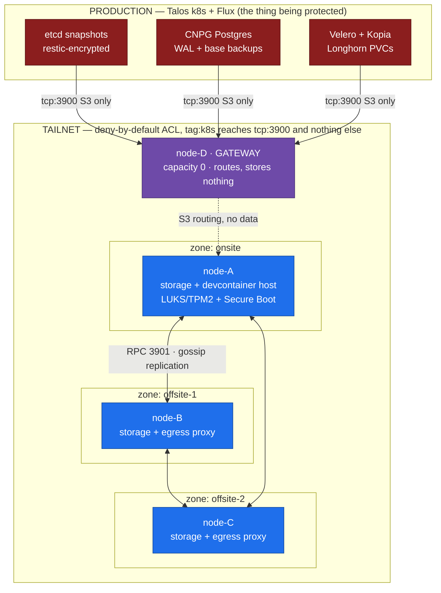
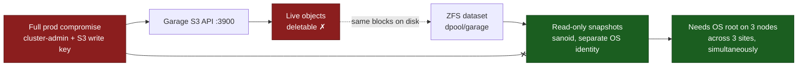
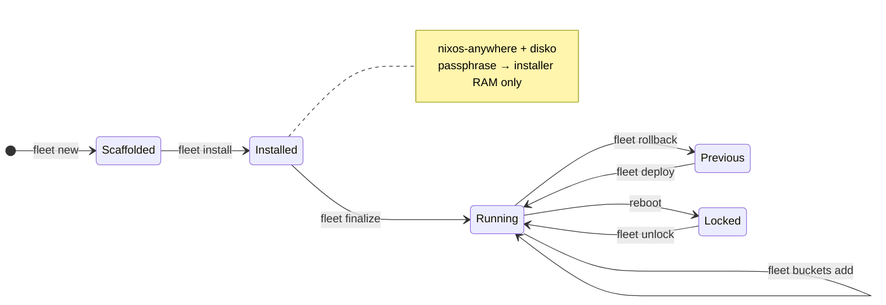

<div align="center">

# `garage-fleet`

**A geo-distributed, ransomware-resistant S3 backup vault — four NixOS machines across three sites, defined entirely as code.**

*Built to be the disaster-recovery target for a production Kubernetes cluster, in a trust domain that cluster cannot reach.*


**Hiring managers and recruiters — start with [PORTFOLIO.md](PORTFOLIO.md)**, a plain-language guide to
what this project is and what it demonstrates.

</div>

---

## At a glance

| | |
|---|---|
| **What** | A self-hosted, S3-compatible object store (Garage) running on four NixOS machines across three physical sites |
| **Why** | The disaster-recovery target for a production Kubernetes cluster — deliberately built in a trust domain that cluster cannot reach |
| **How** | Fully declarative: `disko` + `nixos-anywhere` + `deploy-rs` + `sops-nix`, with one CLI driving the entire node lifecycle |
| **The defence** | ZFS read-only snapshots, pruned by a separate OS identity — immutability that no stolen S3 key can reach |
| **Scale** | ~2 600 lines of Nix · a 1 761-line lifecycle CLI · 7 design and runbook documents (~33 000 words) · 48 commits over 7 weeks |
| **Status** | Live on nodes A + C at replication factor 2 — see [Current state, honestly](#current-state-honestly) |

---

## The one-sentence thesis

> **A backup that shares etcd, PKI, cluster-admin, or trust domain with the system it protects dies with that system.**

Everything in this repository is downstream of that sentence. The backup tier runs a different OS
(NixOS, not Talos), holds different identities (its own `age` keys, not the cluster PKI), sits behind a
different network posture, and has no shared control plane. Ransomware that takes cluster-admin on
production gets the S3 *write* key — and still cannot touch the history.

---

## Architecture

Three storage nodes, one per geographic zone (a full mirror), plus a data-less gateway that is the only
S3 entrypoint production ever talks to. Every listener binds the Tailscale overlay IP — never `0.0.0.0`.



| Port | Purpose | Bind | Reachable by production? |
|---|---|---|---|
| `3900` | S3 API | `tailscale0` only | **yes** — the only port the cluster needs |
| `3901` | Garage RPC / gossip | `tailscale0` only | **no** — RPC reach means joining the cluster |
| `3903` | Admin API **and** metrics | `tailscale0` only, token-gated | **no** — this is the layout/key/bucket control plane, not a metrics endpoint |

---

## The moat: why immutability lives in ZFS, not in S3

Garage has **no S3 Object Lock and no object versioning**. That is not a footnote — it dictates the
entire defence. If the object store cannot enforce immutability, immutability has to be built *around*
it, at a layer no S3 credential and no tailnet identity can address.



Five real layers, in order of who they stop:

| # | Layer | What it actually stops |
|---|---|---|
| 1 | **Client-side encryption** before upload (restic / Kopia paths) | A stolen node or stolen bucket leaks ciphertext only |
| 2 | **ZFS read-only snapshots**, pruned by `sanoid` under a separate OS identity | An S3 key that deletes every object cannot touch history — *the only real immutability tier* |
| 3 | **Separation of duties**: the `garage` service user holds **zero** `zfs allow` | The process that holds the S3 credentials cannot destroy or roll back a snapshot |
| 4 | **Network isolation**: deny-by-default ACL, tailnet-only listeners | Lateral movement, RPC peering, internet exposure |
| 5 | **3-2-1-1-0** with automated restore drills | Backups that silently stopped working weeks ago |

**Honest limitation, stated in the design doc rather than hidden:** object-level separation of duties
does *not* exist here. `restic forget --prune` needs a write grant on the same bucket plus the repo
password, so the pruning identity can delete objects. Retention is best-effort; the security control is
Layer 2 and nothing else.

---

## Design trade-offs

Every decision below is recorded as an ADR in [`documentations/00`](documentations/00-garage-backup-cluster.md#4-decision-records)
with its rejected alternatives. The fourth column is the one that matters — what each choice *costs*.

| Decision | Rejected | Why | **Price paid** |
|---|---|---|---|
| **4 standalone nodes**, not a second k8s cluster | Join prod · build a second Talos cluster | Shared fate is the whole threat. And etcd cannot span a WAN — quorum thrash, split-brain | No orchestrator, no scheduler. The node lifecycle had to be written by hand: a 1 700-line CLI |
| **NixOS + ZFS** | Debian · Fedora CoreOS · Talos | Atomic rollback, no config drift, and ZFS *is* the moat | Steep Nix learning curve. CoreOS would have won outright if ZFS were not mandatory — ZFS fights the ostree image model |
| **Garage** | MinIO · Ceph | Gossip membership (no Raft quorum to co-locate), WAN-native, zone-aware replication, tiny ops footprint | No Object Lock, no versioning — immutability must be rebuilt at the ZFS layer (above) |
| **deploy-rs** | colmena · Ansible · NixOps | Magic rollback auto-reverts a bad firewall/`tailscaled` change on an unreachable offsite node in ~30 s | No protection on the *first* push (no canary baseline), and no support for passphrase-protected SSH keys |
| **SOPS + age + sops-nix** | HashiCorp Vault / OpenBao | A secrets manager for a *backup* system is a circular dependency: it is stateful, must be unsealed, and must itself be backed up — useless during the disaster you need it for | Offline out-of-band key custody is a manual control, and key loss is unrecoverable |
| **ZFS native encryption** | LUKS | Enables `zfs send -w` raw replication — an offsite vault can hold still-encrypted blocks without the key | Leaks pool-level metadata: dataset names, snapshot names, sizes |
| **`keylocation=prompt`** | Auto-unlock at boot | A stolen powered-on box stays ciphertext (see *changed my mind #3*) | Every reboot needs a human — which is why `fleet unlock` exists |
| **node-A doubles as a dev host** | Keep all three nodes boring | One machine, two jobs: onsite storage *and* a remote devcontainer host driven from a Mac | Root Docker is root-equivalent, so **node-A's moat is deliberately forfeited**. B and C hold the real moat and must never take this role |

### node-A: two trust domains on one machine

The sharpest trade in the repo is "the box must reboot unattended" versus "a stolen box must stay
locked". Resolved by splitting node-A across two disks with two different unlock models:

| Disk | Contents | Unlock | Protects against |
|---|---|---|---|
| NVMe — LUKS2 `cryptwork` | root, home, Docker | **TPM2, PCR-7 bound, unattended in initrd** + lanzaboote signed UKIs | Powered-off media theft. The box rejoins the mesh with no operator present |
| HDD — ZFS-native `dpool` | **all of Garage** | **`keylocation=prompt`**, unlocked over the mesh after boot | Whole-box theft, powered on or off. This is the moat |

Passphrase count equals the number of encryption domains needing a human-held secret: node-A has two,
node-B and node-C have one each. None of them is stored anywhere on the fleet — they live in a password
manager and one offline physical copy, and `keylocation=prompt` has no recovery path.

---

## Three things I changed my mind about

Design docs record the plan. These record the plan meeting reality.

### 1. Rosetta silently corrupted every secret in the repo

The workstation devcontainer is `x86_64` **emulated on an Apple Silicon Mac**. Rosetta mis-translates
Go's hand-written assembly ChaCha20-Poly1305. Stock `sops`/`age` therefore produced ciphertext that was
perfectly self-consistent — it decrypted on the workstation — and that **no real node could read**.
The only symptom was at first boot, far from the cause:

```
sops-install-secrets: 0 successful groups required, got 0
```

…and every secret-fed service (`garage`, `tailscaled`) starved. X25519 and AES-GCM survive Rosetta;
only that one assembly path is wrong. The fix is in [`flake.nix`](flake.nix): rebuild `sops` and `age`
with `-tags=purego` to drop the assembly for the generic Go path, and route *every* encrypt-side call —
`scripts/fleet` and `mise.toml` — through those builds. Verified against
RFC 8439 vectors.

### 2. The per-node identity could not decrypt at boot

The original design derived each node's `age` identity from its SSH host key via `ssh-to-age`. Elegant —
one key, no extra material to manage — and it did not work: the `ssh-to-age` implementation bundled in
sops-nix could not decrypt at activation time, so the very first `switch` failed. Replaced with a
**dedicated `age` key per node**, minted *before* install and seeded by `nixos-anywhere --extra-files`
into `/var/lib/sops-nix/key.txt`. The SSH host key is now not seeded at all — `sshd` generates its own.
Fewer moving parts than the clever version.

### 3. "Node theft" was a claim the design could not back

The design doc originally accepted `keylocation=file://` with the ZFS passphrase persisted through
sops-nix — and then said the design defended against node theft. It did not. The node's `age` identity
lives on the same disk as the ciphertext, so a stolen box carries both halves and unlocks its own
backups. Worse, it was the *worst* of both worlds on the offsite nodes: the passphrase was stored **and**
still typed at reboot.

Changed to `keylocation=prompt`, with **no passphrase in any SOPS file, ever** — and built
`fleet unlock` so an offsite reboot is one command over SSH instead of a site visit. The cost (a manual
step per reboot) is now paid deliberately, and the threat-model table says what at-rest encryption
actually buys.

---

## One command for the whole lifecycle

`scripts/fleet` is the single workstation entrypoint — a 1 700-line Bash CLI with a TUI, written because
"no shared-fate orchestrator" means no orchestrator at all.



| Command | What it does |
|---|---|
| `fleet new <node>` | Mints the node's dedicated age key, its Tailscale auth key, its `.sops.yaml` rule, and scaffolds `hosts/*.nix` — idempotent |
| `fleet install <node> root@<ip>` | Bare-metal provision over SSH (disko + nixos-anywhere). Feeds the ZFS passphrase to the installer's **tmpfs only**, then restores prompt-unlock |
| `fleet deploy <node>` | deploy-rs push with magic rollback. `--detached` activates under PID 1 so a `tailscaled` change survives restarting its own transport |
| `fleet unlock <node>` | Finds every locked encryption root over SSH, loads the key, mounts, starts Garage. Passphrase travels on stdin only |
| `fleet layout <show\|apply>` | Reads each host's declared zone + capacity, fetches live node IDs, applies `version+1` once |
| `fleet buckets add <bucket>` | Declares a bucket in `buckets.spec`, mints it a **dedicated** key, pushes it, prints the k8s Secret |
| `fleet status` | Readiness, lifecycle state, and a live SSH probe of each node's `garage.service` |

**One dedicated S3 key per bucket** ([`buckets.spec`](buckets.spec)): a leaked key exposes exactly one
consumer's backups, and a compromised prod workload cannot read another cluster's bucket. The spec is
Git-tracked (names only); the key material lives in a SOPS file encrypted to the **workstation key
alone** — never to a node.

---

## Current state, honestly

The design target and what is actually running are not the same thing, and the repo says so out loud.

| | Design target | Running today |
|---|---|---|
| Storage nodes in layout | A + B + C | **A + C** — node-B offline long-term, config retained |
| Replication factor | 3 (one copy per zone) | **2** — rf cannot exceed the distinct zone count |
| Garage version | v2.3.0 | **2.1.0** — `nixos-25.05` ships no `garage_2_3_0` attribute; needs an input bump or overlay |
| Secure Boot | lanzaboote signed UKIs fleet-wide | **node-A only** (`fleet.secureBoot = true`). B/C/D stay on systemd-boot — each needs its own physical firmware-enrollment trip, which cannot be done over SSH |
| node-D gateway | additive reconfigure of a live prod box | **not yet wired** — commented out of the flake until its hardware config exists, so `nix flake check` stays green |
| Backup jobs | etcd CronJob, CNPG ObjectStore, Velero | Live in the **prod** repo under Flux — deliberately not here |

---

## Documentation

Seven documents, ~33 000 words. Two are architecture (*why* and *how*); the rest are the runbooks
actually used to build the machines — written before and during the build, not reconstructed after.

| Document | What it covers |
|---|---|
| [00 — Garage backup cluster](documentations/00-garage-backup-cluster.md) | **Start here.** Goals and non-goals, the threat model, the topology, all six ADRs with rejected alternatives, the Garage data plane, the five-layer ransomware defence, and the secrets model |
| [01 — Implementation plan](documentations/01-garage-backup-implementation-plan.md) | The phased build runbook: secrets custody → provision A → provision B/C and form the cluster → node-D gateway → backup jobs → moat → monitoring → restore drills → cutover. Includes the risk register and secrets inventory |
| [02 — node-B image flash](documentations/02-node-b-image-flash.md) | Building a NixOS disk image on the workstation and `dd`-ing it to NVMe. **Superseded by 03** — kept because the rejected approach and the reason it was dropped are part of the record |
| [03 — node-B USB install](documentations/03-node-b-usb-install.md) | The chosen method: boot the installer USB, partition with `disko`, install the flake |
| [04 — node-A + node-B install](documentations/04-node-a-b-install.md) | The dual-disk runbook — node-A's LUKS/TPM root and node-B's prompt-unlock. Carries a dated CORRECTIONS block that supersedes the body where they conflict |
| [05 — node-A secure pipeline](documentations/05-node-a-secure-pipeline.md) | Bare metal → hardened, unattended-booting node: LUKS, TPM2 enrollment, Secure Boot with lanzaboote. Order is load-bearing and the document says why |
| [06 — Garage buckets guide](documentations/06-garage-buckets-guide.md) | Declarative S3 buckets and keys: adding a bucket with its own dedicated key, and accessing it from a client |

> Documents 00 and 01 were authored in the production cluster's repository and bundled here. Their bare
> `documentations/0X-*.md` references and Flux/Kubernetes paths point at *that* repo, not this one.

---

## Reading this repo in five minutes

| Start here | Why |
|---|---|
| [`documentations/00`](documentations/00-garage-backup-cluster.md) §2 + §4 | The threat model and all six ADRs, each with its rejected alternatives |
| [`flake.nix`](flake.nix) | A `hosts` attrset derives every `nixosConfiguration`, a per-node `-install` variant, and the deploy-rs map — adding a node is one line |
| [`modules/zfs-sanoid.nix`](modules/zfs-sanoid.nix) | The moat, with the invariant that makes it real written above the code |
| [`hosts/disko-node-a.nix`](hosts/disko-node-a.nix) | Two trust domains expressed as one declarative disk layout |
| [`scripts/fleet`](scripts/fleet) | The lifecycle CLI |

> **Note on placeholder values.** This is a public mirror of a live fleet. The Tailscale
> tailnet name, the per-node overlay IPs, the Garage node IDs, and the operator SSH key are
> replaced with placeholders (`<tailnet>`, `100.64.0.1x`, `aaaa…`/`bbbb…`, `operator@workstation`).
> Everything else is the real configuration. Set your own with `fleet config tailnet <name>` and
> the `fleet.tailscaleIp` option per host. Encrypted `secrets/*.enc.yaml` are committed on
> purpose — a flake only sees Git-tracked files, so a gitignored secret is invisible to sops-nix
> at activation. No private key material has ever been committed to this repository.

### Layout

```
garage-fleet/
├── flake.nix              # hosts attrset → nixosConfigurations + -install variants + deploy map
├── buckets.spec           # declarative S3 buckets, one dedicated key each (names only, not secret)
├── modules/
│   ├── base.nix           # SSH hardening, nftables (trusts tailscale0 only), users, the fleet.* options
│   ├── garage.nix         # services.garage; every listener bound to the overlay IP
│   ├── zfs-sanoid.nix     # the moat: read-only snapshots, garage user holds zero zfs allow
│   ├── secureboot.nix     # node-A only: lanzaboote UKIs + TPM2 LUKS unlock + enrollment runbook
│   ├── sops.nix           # derives the per-node secret file from networking.hostName
│   ├── workstation.nix    # node-A only: devcontainer host (and the reason its moat is forfeited)
│   └── scrape-proxy.nix   # tailnet-only HTTP egress proxy, enabled on B/C
├── hosts/                 # node-a…d + one disko file per machine
├── secrets/               # SOPS-encrypted, committed (a flake only sees Git-tracked files)
├── scripts/fleet          # the lifecycle CLI
└── documentations/        # 7 documents: design + ADRs, phased runbook, per-node install guides
```

### By the numbers

| | |
|---|---|
| Machines / sites / zones | 4 · 3 · 3 |
| Nix | ~2 600 lines across 22 files — modules, host definitions, and disk layouts |
| Lifecycle CLI | 1 761 lines of Bash, 12 subcommands, TUI |
| Documentation | 7 documents, ~33 000 words — design records, runbooks, and per-node install guides |
| Architecture decision records | 6, each with rejected alternatives |
| History | 48 commits over 7 weeks |

---

<div align="center">

**Stack** — NixOS 25.05 · OpenZFS · Garage S3 · disko · nixos-anywhere · deploy-rs · sops-nix · age ·
Tailscale · sanoid · lanzaboote · systemd-cryptenroll · TPM2

*Released into the public domain ([Unlicense](LICENSE)).*

</div>
