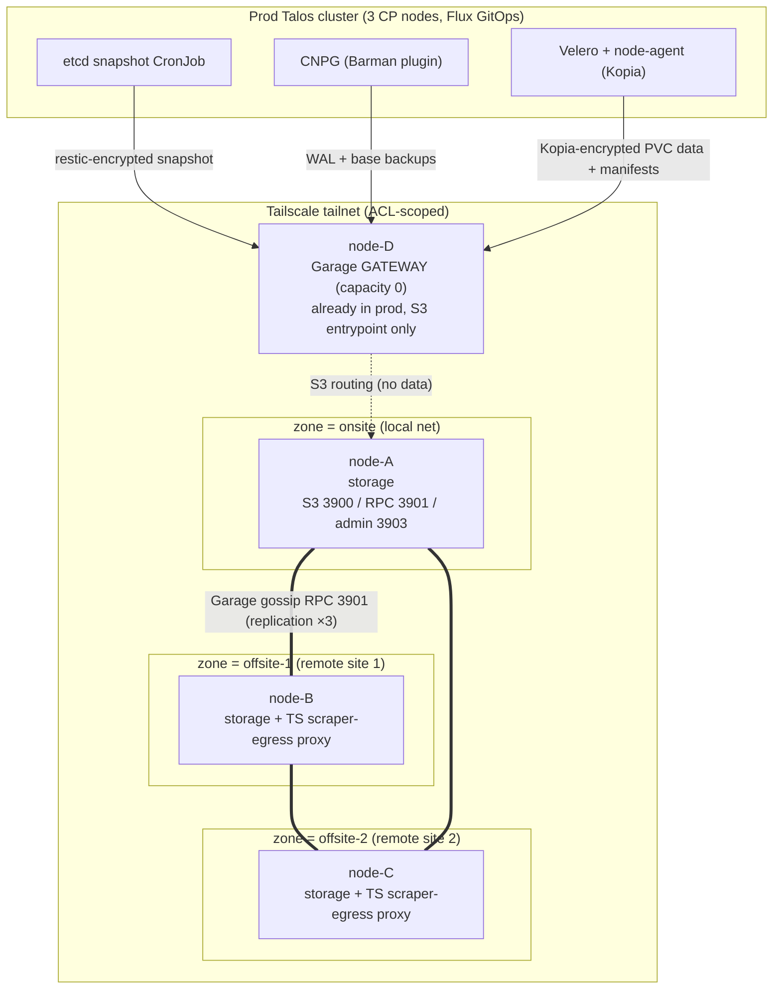
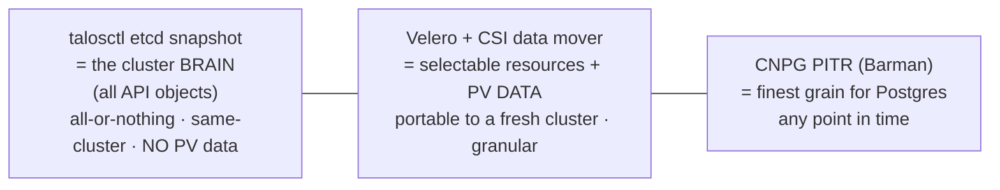

# Garage backup cluster — geo-distributed, ransomware-resistant DR store

A self-hosted, S3-compatible **Garage** object store spanning four standalone
nodes across three sites, built to be the durable backup/DR target for the prod
Talos cluster. It protects **etcd** (control-plane brain), **CNPG Postgres**
(point-in-time), and **selected Longhorn PVCs** (portable data). Every design
choice optimises for four things in order: **security-by-design**,
**ransomware resistance**, **fully-IaC**, and **least manual ops AND restore**.

This is the design + decision record. The phased build runbook is
`documentations/10-garage-backup-implementation-plan.md`. The CNPG→object-store
mechanics (ObjectStore CRD, Barman Cloud Plugin, WAL archiving, PITR, Flux
CRD/CR ordering) are **already documented in `documentations/03-backups.md`**;
this doc *extends* that — Garage becomes an additional, self-hosted destination,
so 03 is referenced rather than repeated.

> **Note:** this doc was authored in the prod cluster repo (`k3sclusterforlearning`)
> and bundled here for reference. Bare `documentations/0X-*.md` references (e.g.
> `03-backups.md`, `05-alerting.md`) and the Flux/k8s paths (`infrastructure/`,
> `clusters/`, `apps/`, `bootstraping/`) live in **that prod repo**, not in this
> garage-fleet repo.

> ⚠️ **Design only — not yet applied.** No node is provisioned. The Garage
> version, NixOS channel, and chart pins in doc 10 are the source of truth for
> the build; this doc explains *why* the shape is what it is.

---

## 1. Goals and non-goals

### Goals

- **A backup that survives the thing it backs up.** A separate trust domain —
  different OS, credentials, network, and lifecycle from prod — so a ransomware
  or admin compromise of the Talos cluster cannot reach the backups (§2).
- **3-2-1-1-0**: 3 copies, 2+ locations (2 offsite), 1 immutable tier (ZFS
  snapshots), 0 errors proven by automated restore-drills (§7).
- **Geo-distributed durability**: full mirror across three sites; survives loss
  of any two sites (§5).
- **Fully declarative**: the four nodes are NixOS-as-code; the backup *jobs* are
  Flux-managed CRs in the prod cluster. No hand-applied state on either side.
- **Least manual ops AND restore**: scheduled, monitored, alerted, drilled. The
  *only* deliberately-manual control is offline break-glass key custody (§8).

### Non-goals

- **Not a second Kubernetes/Talos cluster.** The four nodes are not joined to
  prod and are not formed into their own k8s cluster (ADR-1).
- **Not application HA / not a hot standby.** This is cold/warm DR, not failover.
- **Not a general-purpose S3 service.** Buckets exist only for backup tooling.
- **Not heavy compute.** Storage nodes stay boring; future per-site compute is a
  *separate* lightweight cluster, never merged into prod (ADR-1, §4).
- **Does not replace 03.** R2 remains the existing CNPG target; Garage is an
  additional/alternative destination, not a migration of 03.

---

## 2. Threat model and the blast-radius principle

The store is designed against a concrete adversary list, not "backups in case a
disk dies".

| Threat | Vector | Primary defence |
|---|---|---|
| **Ransomware on prod** | attacker gets cluster-admin / a node, encrypts or deletes everything reachable | separate trust domain (ADR-1); ZFS snapshot moat unreachable by S3 creds (§7) |
| **Compromised backup S3 key** | stolen Garage access key with `write` → mass `DeleteObject` | client-side encryption on the restic/Kopia paths (ciphertext only — **CNPG is the exception**, see §6); ZFS snapshots survive any S3 delete (§7) |
| **Site loss** | fire/flood/ISP-death at one location | replication factor 3 across 3 zones — lose any 2 sites, still readable (§5) |
| **Node theft** | a physical box walks off | client-side-encrypted payloads (Garage holds only ciphertext for restic/Kopia); ZFS at-rest **auto-unlocks at boot** (§7) so it protects only against media-only theft, not whole-box theft — see §7 boot-trust note |
| **Operator error** | fat-fingered `kubectl delete`, bad restore target | Velero granular restore + CNPG PITR + ZFS rollback as last resort (§10) |
| **Key loss** | age key / restic password / ZFS key gone → backups are unrecoverable bricks | offline out-of-band custody in 2 physical locations (§8) |
| **Backups silently stopped** | a job dies and nobody notices for weeks | dead-man's-switch staleness alert + automated restore-drills (§9) |
| **Prod cluster is a tailnet peer** | the prod cluster reaches Garage *through the tailscale-operator* — a full prod compromise yields the operator OAuth creds (which can mint new `tag:k8s` devices) and an in-cluster S3 write key, putting the attacker **on the tailnet** | deny-by-default ACL: `tag:k8s` reaches **only** `tcp:3900` (S3) on `tag:garage`, never RPC (3901) or admin (3903); the moat is the ZFS layer, which no tailnet identity can reach (§3, §7) |
| **Gateway (node-D) compromise** | node-D is a pre-existing prod box that holds the shared `rpc_secret` and sits on the data path | `rpc_secret` only grants RPC peering over ciphertext objects; isolate node-D's prod workload from the Garage service so a prod-service compromise can't read `/run/secrets/garage-rpc` (§3) |

**Blast-radius isolation** is the spine of the whole design: *a backup that
shares etcd, PKI, cluster-admin, or trust domain with the system it protects
dies with that system.* Ransomware that holds cluster-admin, an admin-credential
leak, or etcd corruption would otherwise reach prod **and** its backups in one
shot. Therefore the backup tier deliberately shares **nothing** with prod —
different OS (NixOS, not Talos), different identities (sops-nix age keys, not the
cluster PKI), different network posture (its own tailnet ACL scope), different
control plane (no shared etcd). This is asserted, not assumed, and ADR-1 is the
mechanism that enforces it.

### The prod cluster is a semi-trusted tailnet peer, not a third party

The "separate trust domain" claim above must be read honestly: the prod cluster
is **not** an external party that merely happens to talk to Garage. The bridge
into the tailnet is the in-cluster `tailscale-proxy-0X` created by the
**tailscale-operator** (see `infrastructure/controllers/staging/tailscale-operator/README.md`).
That operator authenticates with OAuth client creds scoped **Devices Core =
write AND Auth Keys = write** and tags every device it spawns `tag:k8s`.
Therefore a *full* prod-cluster compromise yields:

- the Garage S3 **write keys** (in-cluster `*.enc.yaml` Secrets);
- the operator **OAuth creds**, which can mint **new** `tag:k8s` tailnet devices;
- a live L3 path to Garage's S3 endpoint over the tailnet.

The attacker is thus *on the tailnet with a Garage-reaching identity*. The
network "separation" is operator-controlled from inside the very thing being
protected. The mitigation is **not** to pretend the cluster is external; it is
that (a) the ACL is deny-by-default so `tag:k8s` can reach **only** S3
(`tcp:3900`) on `tag:garage` — never RPC (3901) and never the admin API (3903),
and (b) the real immutability lives at the ZFS layer (§7), which no tailnet
identity — including a freshly minted `tag:k8s` device — can reach. The S3 write
key can delete *live* objects; it cannot touch ZFS snapshots.

---

## 3. Topology and node roles

Four **standalone NixOS + ZFS** machines, separate from the three prod
control-plane nodes. Three hold data (one per zone = full mirror); one is a
data-less gateway that already exists in production and is repurposed.



| Node | Zone | Role | Garage capacity | Also runs | Network |
|---|---|---|---|---|---|
| `node-A` | `onsite` | storage | non-zero (sized to backup set) | — | cluster LAN + tailnet; fast writes |
| `node-B` | `offsite-1` | storage + proxy | non-zero | Tailscale scraper-egress proxy | tailnet only |
| `node-C` | `offsite-2` | storage + proxy | non-zero | Tailscale scraper-egress proxy | tailnet only |
| `node-D` | (remote) | **gateway** | **0 / `--gateway`** | already-prod proxy duties | tailnet only |

| Port | Purpose | Bind | Reachable by `tag:k8s` (prod cluster)? |
|---|---|---|---|
| `3900` | S3 API (clients) | `tailscale0` IP only | **yes** — the only port the cluster needs |
| `3901` | Garage RPC / gossip (cluster) | `tailscale0` IP only | **no** — `tag:garage` ↔ `tag:garage` only |
| `3902` | S3 web (unused) | disabled / not exposed | no |
| `3903` | admin API **and** Prometheus `/metrics` (same listener) | `tailscale0` IP only, token-gated | **no** — admin API ⇒ layout/key/bucket control; scrape from a tailnet-side Prometheus instead (§9) |

**Network rule:** every Garage port binds to the node's `tailscale0` overlay IP,
never `0.0.0.0`. The S3 API, RPC, and admin/metrics endpoints are reachable
*only* over the tailnet, and Tailscale ACLs restrict who may reach them. The ACL
is **deny-by-default**, not an allow-list that quietly widens:

- `tag:garage ↔ tag:garage` on `3900,3901,3903` (the storage/gateway fleet talks
  to itself).
- `tag:k8s` (the operator-spawned in-cluster proxy and any device it can mint) →
  `tag:garage` on **`tcp:3900` only**. Never 3901 (RPC peering would let a
  compromised cluster join the gossip cluster) and never 3903 (the admin API on
  `3903` is **not** metrics-only — it is the layout/key/bucket control plane; a
  cluster that reaches it and holds or guesses `admin_token` gets cluster
  control, not read-only metrics).

`rpc_secret` is a single shared 32-byte hex value across all four nodes — it is
effectively **cluster-admin-equivalent for Garage**: anyone holding it *plus* RPC
reach can join the gossip cluster and route/read data. node-D, the gateway, is a
**pre-existing production box** that holds this same `rpc_secret`; treat a node-D
compromise as leaking cluster-wide RPC trust (mitigation: objects are
client-side ciphertext on the restic/Kopia paths, ZFS snapshots need OS root and
are unreachable via RPC, and node-D's prod workload should be isolated from the
Garage service — §2). Clients prefer the onsite `node-A` for read/write;
replication to offsite is async gossip and link-flap tolerant.

> ⚠️ Binding any Garage port to `0.0.0.0` with a loose host firewall exposes the
> S3 API beyond the tailnet and defeats the network isolation the whole moat
> assumes. The host firewall trusts only `tailscale0`. **And** the admin port
> `3903` is the control plane, not a metrics-only endpoint — never grant the
> prod cluster reach to it; scrape metrics from a tailnet-side Prometheus (§9).

---

## 4. Decision records

ADR format: **decision**, **why**, **rejected alternatives**. These record an
*already-converged* architecture; alternatives are recorded as rejected, not
reopened.

### ADR-1 — The 4 nodes are standalone, NOT clustered (not joined to prod, not their own k8s)

**Decision.** The four backup nodes are independent NixOS hosts. They are not
joined to the prod Talos cluster, and they are not formed into a second
Talos/Kubernetes cluster. They cooperate *only* as a Garage gossip cluster.

**Why — two independent, each-fatal reasons:**

1. **Blast-radius isolation (security).** A backup that shares etcd / PKI /
   cluster-admin / trust domain with the system it protects dies with it — one
   ransomware event, one admin compromise, or one etcd corruption reaches both.
   Backups *must* be a different trust domain (§2). Joining prod, or rebuilding a
   second Talos cluster with the same tooling and admin reach, recreates exactly
   the shared fate we are paying to avoid.
2. **etcd cannot span the WAN (physics).** A Talos control plane needs a
   low-latency, co-located etcd quorum. Four nodes across three sites would mean
   cross-WAN etcd → quorum thrash and split-brain. Geography alone forbids
   clustering these. Garage is **gossip-based and WAN-native** and embraces the
   exact geography etcd cannot survive.

**Rejected alternatives.** *Join the backup nodes to prod* — shared fate,
rejected on reason 1. *Stand up a second Talos/k8s cluster across the 3 sites* —
rejected on reason 2 (etcd can't span the WAN) and reason 1 (same tooling/trust
reach). *Future heavy compute* belongs in a **separate per-site lightweight
cluster**, declared in the same NixOS fleet but never merged into prod; storage
nodes stay boring.

### ADR-2 — OS = NixOS + ZFS (not Debian, not Fedora CoreOS, not Talos)

**Decision.** Each node runs NixOS with ZFS, defined as one declarative
`configuration.nix` per node in git.

**Why.** NixOS makes the *whole node* OS-as-code: atomic upgrade + rollback via
boot generations, reproducible with no config drift (a security property — no
unmanaged state to subvert), and it fits the team's existing
declarative/GitOps mindset. **ZFS** is first-class on NixOS and is the
ransomware moat: read-only snapshots, native encryption, and `zfs send -w` raw
replication (§7). Workloads that *do* belong on these nodes (the Tailscale
proxy, scraper-near proxy, future jobs) are declared as Podman/systemd-quadlet
containers inside `configuration.nix`.

**Rejected alternatives.** *Debian/Fedora (imperative)* — config drift, no
atomic rollback, not OS-as-code. *Talos* — it is a Kubernetes appliance; running
it here would push us back toward ADR-1's rejected "second cluster". *Fedora
CoreOS* — would win **if ZFS were not needed** (ostree + automatic updates are
excellent), but ZFS on ostree fights the immutable-image model, and ZFS is
non-negotiable here because it *is* the moat.

### ADR-3 — Data plane = Garage gossip cluster (not MinIO, not Ceph) for geo-distribution

**Decision.** Garage forms its own gossip cluster over Tailscale, replication
factor 3 across the three storage zones; `node-D` is a capacity-0 gateway.

**Why.** Garage is purpose-built for **geo-distributed, high-latency,
heterogeneous** deployments: gossip membership (no Raft/etcd quorum to co-locate),
zone-aware replication that guarantees one copy per zone, link-flap tolerance,
and a tiny operational footprint. Replication factor 3 over three zones means
every object is fully mirrored on A, B, and C → survives loss of any two sites.

**Rejected alternatives.** *MinIO* — its distributed mode expects low-latency,
homogeneous nodes (erasure sets within a site); it is not designed to stretch
erasure coding across the WAN, and multi-site is sold as active-active *site
replication* between independent clusters, which is heavier than we need. *Ceph*
— far more powerful, far more operational burden (MON quorum is itself
latency-sensitive, like etcd), contradicting "least manual ops". Garage is the
right size for a four-node, three-site backup vault.

> ⚠️ Garage has **no native immutability** (§5): no S3 Object Lock and, as of
> stable v2.3.0 (June 2026), **no S3 object versioning** either. That is *why*
> the moat lives at the ZFS layer (§7), not in Garage's API.

### ADR-4 — Fleet/config management = disko + nixos-anywhere + colmena/deploy-rs + sops-nix (no shared-fate control plane)

**Decision.** Provision and manage the fleet with declarative Nix tooling:
**disko** (disk + ZFS layout), **nixos-anywhere** (bare-metal provision over
SSH), **colmena** *or* **deploy-rs** (push `configuration.nix` to all four nodes
in one command), **sops-nix** (decrypt SOPS+age secrets at activation).

**Why.** Single pane of glass, no shared-fate orchestrator. disko gives the ZFS
pool/dataset layout as code; nixos-anywhere builds bare metal from nothing over
SSH; one push command converges the whole fleet; sops-nix materialises secrets
declaratively into `/run/secrets`. For the *remote* nodes reachable only over
Tailscale, **deploy-rs is preferred for its magic-rollback** — a bad
`tailscaled`/firewall change auto-reverts within ~30s instead of stranding a node
you can't physically reach. colmena is simpler if out-of-band console exists.

> ⚠️ **Low-confidence-flagged caveats from the research bundle:** (a) deploy-rs
> magic-rollback only protects you once a *prior* generation was also deployed by
> deploy-rs — the first push after nixos-anywhere has no canary baseline, so do
> the first reachable-config deploy with console/initrd-SSH fallback available.
> (b) Neither tool supports passphrase-protected or per-host SSH keys — configure
> identities in `~/.ssh/config` keyed by Tailscale MagicDNS name. Both are
> implementation cautions for doc 10, not design changes.

**Rejected alternatives.** *Imperative Ansible/SSH scripts* — drift, not
OS-as-code (also rejected by ADR-2). *NixOps* — heavier/older state model than
the disko + nixos-anywhere + push-deploy combo.

### ADR-5 — Backup tooling layered: etcd snapshot + CNPG PITR + Velero (jobs run in prod, Flux-managed)

**Decision.** Three complementary data-plane jobs run **inside** the prod
cluster (Flux-managed CRs), each writing to Garage: a `talosctl etcd snapshot`
CronJob, CNPG continuous WAL + scheduled base backups (Barman Cloud Plugin, per
03), and Velero with the Longhorn CSI data mover.

**Why.** They cover different grains and *stack* (§6). No single tool captures
the cluster brain, portable PV data, and Postgres PITR at once.

**Rejected alternatives.** *etcd snapshot alone* — captures all API objects but
**no PV data** and only resurrects the *same* cluster. *Velero alone* — portable
and granular but not the right tool for Postgres-grade PITR, and it does not
capture etcd. *Longhorn-native recurring backups for the same PVCs Velero moves*
— rejected as **double backup** (competing snapshot churn + retention races on
one volume); Velero CSI data movement is the single PVC mover (§6).

### ADR-6 — Secrets = SOPS + age + sops-nix (not HashiCorp Vault / OpenBao)

**Decision.** Reuse the repo's existing SOPS + age tooling for cluster-side
secrets and **sops-nix** for the nodes. No Vault/OpenBao.

**Why.** A secrets manager for a *backup* system is a circular dependency: Vault
is stateful, must be unsealed, HA'd, and *itself backed up* — and if it's down
during a disaster you can't read the keys you need to *restore*. It adds
operational burden and attack surface and contradicts least-maintenance. SOPS+age
is stateless, already in the repo (`.sops.yaml`, path-selected age recipients),
and sops-nix decrypts the same files into NixOS at activation.

**Rejected alternatives.** *HashiCorp Vault / OpenBao* — circular dependency +
ops burden + attack surface (above). The deliberate trade is that the age
private key and restic/borg passwords need **offline out-of-band custody** (§8)
— the one accepted manual control.

---

## 5. Data plane: Garage cluster configuration

### Layout, zones, replication

Garage's layout is a *versioned table* mapping each node to a zone with a
capacity (storage) or `--gateway` (no data). `replication_factor = 3` with three
distinct storage zones places one copy of every partition in each zone — a full
mirror on A, B, C. Tolerates **2 node/site failures** while still serving;
normal read/write continues during a single-site outage.

| Setting | Value | Why |
|---|---|---|
| `replication_factor` | `3` | full mirror across 3 zones; survives loss of any 2. Must be **identical in every node's config** |
| zones | `onsite`, `offsite-1`, `offsite-2` | one storage copy per zone |
| `node-D` | `--gateway`, capacity 0 | S3 entrypoint + routing, stores no data |
| `consistency_mode` | `consistent` (default) | write-quorum 2 / read-quorum 2 → read-after-write. Keep it; only drop to `degraded` if a whole site is down and stale reads are acceptable |
| `db_engine` | `lmdb` (default) | required default for `replication_factor ≥ 2` |
| `metadata_auto_snapshot_interval` | e.g. `"6h"` | guards against **non-recoverable LMDB corruption** after unclean shutdown |

Illustrative `garage layout` (staged → applied; never apply the same `--version`
twice):

```bash
garage layout assign <A_id> -z onsite    -c 2T
garage layout assign <B_id> -z offsite-1 -c 2T
garage layout assign <C_id> -z offsite-2 -c 2T
garage layout assign <D_id> --gateway              # capacity 0, no data, NO zone
garage layout show                                  # review staged
garage layout apply --version <prev+1>              # commit exactly prev+1
```

Illustrative `garage.toml` excerpt (rendered by `services.garage.settings` via
sops-nix; binds to the overlay IP):

```toml
replication_factor = 3
db_engine          = "lmdb"
metadata_dir       = "/srv/garage/meta"   # ZFS: bpool/garage/meta
data_dir           = "/srv/garage/data"   # ZFS: bpool/garage/data
metadata_auto_snapshot_interval = "6h"
rpc_secret_file    = "/run/secrets/garage-rpc"   # sops-nix, shared across nodes
rpc_bind_addr      = "[<tailscale0-ip>]:3901"
rpc_public_addr    = "<tailscale0-ip>:3901"       # overlay IP, not LAN/public

[s3_api]
api_bind_addr = "<tailscale0-ip>:3900"
s3_region     = "garage"

[admin]
api_bind_addr      = "<tailscale0-ip>:3903"
metrics_token_file = "/run/secrets/garage-metrics"   # else /metrics is UNAUTHENTICATED
admin_token_file   = "/run/secrets/garage-admin"
```

> ⚠️ Use the `*_file` token variants (supported since Garage v0.8.2), **not**
> inline `admin_token = "…"`/`metrics_token = "…"`. `services.garage.settings`
> renders this TOML into the **world-readable Nix store**; an inline token value
> leaks the secret there and breaks the sops-nix-only secrets model (§8). The
> `_file` variants point at sops-nix paths (`/run/secrets/garage-metrics`,
> `/run/secrets/garage-admin`), matching doc 10 Phase 1 — `rpc_secret_file`
> above is already file-based; the two token keys follow suit.

> ⚠️ Over Tailscale, `rpc_public_addr` **must** be each node's overlay IP and
> peers must be listed as `pubkey@overlay_ip:3901`; a LAN/public address there is
> unreachable over the tailnet and the cluster won't form. The `/metrics`
> endpoint is **unauthenticated by default** — set `metrics_token_file` and bind
> admin to the overlay only.

### Keys, buckets, and the immutability caveat

Garage's permission model is **per-access-key-per-bucket** with three levels —
`read`, `write`, `owner` — and **no S3 ACLs or bucket policies**. One bucket per
backup tool keeps grants and retention independent:

| Bucket | Writer key grant | Purpose |
|---|---|---|
| `etcd-snapshots` | `write` | restic repo for `talosctl etcd snapshot` |
| `cnpg-pitr` | `write` | CNPG base backups + WAL (Barman) |
| `velero` | `write` | Velero manifests + Kopia PVC data (BSL) |

```bash
garage bucket create etcd-snapshots
garage key create etcd-backup-writer
garage bucket allow --read --write etcd-snapshots --key etcd-backup-writer
```

> ⚠️ **No object-level immutability inside Garage.** `write` includes
> `DeleteObject`; a compromised `write`/`owner` key can wipe a bucket. As of
> stable **v2.3.0 (June 2026)**, Garage supports **neither S3 Object Lock**
> (`Get/PutObjectRetention`, `…LegalHold`, `…LockConfiguration` all *Missing*)
> **nor S3 object versioning** (issue #166 still **open**; `GetBucketVersioning`
> is a stub; only WIP in PR #1336). The earlier seed note claiming versioning
> exists was **wrong** — do not design assuming versioned buckets. Immutability
> therefore comes **entirely from outside Garage**, at the ZFS layer (§7). This
> strengthens, not weakens, the design: the moat does not depend on any Garage
> API feature.

### Circular-dependency note: where the data actually lives

Garage stores metadata + data on **node-local ZFS datasets**
(`bpool/garage/meta`, `bpool/garage/data`), *not* on Longhorn PVCs. This is
deliberate: putting the backup store on Longhorn would be backing up
Longhorn-on-Longhorn — a circular dependency on the very storage layer we're
protecting. Node-local ZFS breaks that loop and is what makes the snapshot moat
possible.

---

## 6. What gets backed up — and the brain/attachments distinction

The three layers are **not redundant**; they capture different things at
different grains and stack. Read 03 for the CNPG ObjectStore/Barman/PITR
mechanics — here we only place CNPG in the layering and point its destination at
Garage.



Analogy: **etcd snapshot is the brain** (every API object, all-or-nothing, only
resurrects the *same* cluster, holds **no PV data**); **Velero is the
attachments** (chosen namespaces + actual PV bytes, portable to a *fresh*
cluster, granular per-resource); **CNPG PITR is a surgical instrument** for one
organ (Postgres, restorable to any second). They overlap intentionally at the
edges and back each other up.

| Layer | Tool | Captures | Restore target | Encryption | Schedule (illustrative) |
|---|---|---|---|---|---|
| **etcd** | `talos-backup` (`talosctl etcd snapshot`) → age → Garage | whole etcd keyspace (API objects), **no PV data** | *same* cluster via `bootstrap --recover-from` | **client-side** (age via `AGE_RECIPIENT_PUBLIC_KEY`) | hourly/daily CronJob |
| **Postgres** | CNPG Barman Cloud Plugin → Garage (see 03) | base backups + continuous WAL | *new* CNPG cluster, PITR to any time | **NOT client-side** — gzip compress only; SSE caveat (see note) | base daily 03:00 + continuous WAL |
| **k8s + PVCs** | Velero + Longhorn CSI data mover (Kopia) → Garage BSL | selected namespaces' manifests + selected **PV data** | *fresh* cluster, granular | **client-side** (Kopia) | scheduled Velero `Schedule` |

> ⚠️ **The "leaks only ciphertext" guarantee is scoped to the restic/Kopia
> (etcd, Velero) paths.** CNPG is the exception: barman-cloud `gzip` is
> *compression, not encryption*, and `encryption: AES256` (if set) is S3
> **server-side** encryption, which Garage may not honour. So CNPG WAL/base
> backups may land on Garage as **plaintext at rest**, protected only by tailnet
> transit and ZFS-at-rest (which auto-unlocks at boot — §7). Do **not** read the
> global "encrypt before upload" framing as covering Postgres, the most sensitive
> payload. If true client-side encryption is required for Postgres, it must be
> added explicitly (e.g. a wrapper that encrypts before S3); otherwise treat
> Postgres as the documented exception.

**etcd.** A `talosctl etcd snapshot` is a single atomic, internally consistent
copy from **one** healthy CP node (never merge members). An in-cluster CronJob
needs Talos `machine.features.kubernetesTalosAPIAccess.enabled: true` with
`allowedRoles: [os:etcd:backup]` and the job's namespace allow-listed, plus a
**least-privilege** scoped talosconfig (`os:etcd:backup`, *not* `os:admin`)
mounted as a Secret. Sidero's `talos-backup` is the reference tool; the env var
names below are the ones it actually reads (per its upstream
`cronjob.sample.yaml`) — `CUSTOM_S3_ENDPOINT`, `BUCKET`, `CLUSTER_NAME`,
`USE_PATH_STYLE`, and the client-side-encryption recipient
`AGE_RECIPIENT_PUBLIC_KEY`. CronJob skeleton:

```yaml
apiVersion: batch/v1
kind: CronJob
metadata: { name: etcd-snapshot, namespace: backup }
spec:
  schedule: "0 * * * *"            # hourly
  jobTemplate:
    spec:
      template:
        spec:
          restartPolicy: OnFailure
          containers:
            - name: snapshot
              image: <talos-backup pinned>
              env:
                - { name: CUSTOM_S3_ENDPOINT, value: "http://<garage-ts-svc>:3900" }
                - { name: USE_PATH_STYLE, value: "true" }
                - { name: BUCKET, value: "etcd-snapshots" }
                - { name: CLUSTER_NAME, value: "homelab-staging" }
                - { name: AGE_RECIPIENT_PUBLIC_KEY, valueFrom: { secretKeyRef: { name: etcd-backup-age, key: pub } } }
              # talosconfig (os:etcd:backup) + S3 creds mounted from Secrets
```

> ⚠️ The client-side-encryption recipient var is **`AGE_RECIPIENT_PUBLIC_KEY`**,
> not `AGE_X25519_PUBLIC_KEY` or any other name. With the wrong name talos-backup
> does not pick up the age recipient and uploads **unencrypted** snapshots —
> directly defeating the "client-side encrypted before upload" guarantee this
> design rests on. Verify against the upstream `cronjob.sample.yaml`.

**CNPG.** Mechanics are in 03. For Garage, a Garage-targeted `ObjectStore` is
just another ObjectStore with a different `destinationPath`/`endpointURL`/
credentials `Secret`. Two Garage-specific deltas vs the R2 example in 03:
- The R2 `instanceSidecarConfiguration.env`
  `AWS_REQUEST_CHECKSUM_CALCULATION` / `AWS_RESPONSE_CHECKSUM_VALIDATION =
  when_required` block exists **only** to work around Cloudflare R2 rejecting
  boto3≥1.36 checksums (plugin issue #411). Garage is a MinIO-style server that
  generally accepts those checksums — **omit that env block for Garage** unless a
  checksum error is actually observed.
- Garage over Tailscale is reachable as **HTTP** on the tailnet → omit
  `endpointCA`. Garage requires **path-style** addressing (like MinIO). Treat
  `encryption: AES256` as **S3 server-side** encryption, not client-side — verify
  Garage honours the SSE header before relying on it; otherwise leave it unset
  and rely on tailnet transit + ZFS at-rest. **Note the deliberate divergence:**
  the live R2 ObjectStores (`apps/staging/databases/asp/objectstore.yaml`,
  `infrastructure/services/staging/keycloak/database/objectstore.yaml`) set
  `encryption: AES256` on both `wal` and `data`; the Garage ObjectStore
  intentionally **omits** it pending that SSE-honouring check. This is an
  intentional change from the established repo pattern, not an oversight — doc 10
  Phase 4b's skeleton omits `encryption` for the same reason.

**WAL-archiver constraint (resolve before wiring).** CNPG's plugin marks exactly
**one** `ObjectStore` as `isWALArchiver: true` — a Postgres cluster cannot have
two simultaneous WAL archivers. So "add Garage *alongside* R2" is not a free
additive change for the *same* cluster: base backups can fan out, but continuous
WAL archiving has a single destination. The design therefore picks **one** of:
- **(a) Garage replaces R2 as the WAL archiver** — then doc 03's R2 ObjectStore
  is demoted to base-only or removed, and Garage holds the full PITR chain
  (WAL + base) so a Garage-only PITR restore drill is valid; or
- **(b) R2 stays the WAL archiver, Garage receives independent scheduled base
  backups only** — then a Garage-only restore is *base-only*, **not** true PITR,
  and the restore drill (§10, doc 10 Phase 7) must be scoped to a base restore.

Doc 10 Phase 4b records the chosen fork; the restore drill in §10 / doc 10
Phase 7 must match it. Do not present a Garage-only PITR drill if Garage is not
the WAL archiver.

**Velero + Longhorn.** Use CSI **Snapshot Data Movement** (`--snapshot-move-data`):
a CSI snapshot of the Longhorn PVC → temp PVC → the **node-agent** data mover
**Kopia-uploads encrypted bytes** to the Garage BSL. Requirements: install with
`--use-node-agent` (the node-agent daemonset is **mandatory** or PVC data is
silently not moved); label the Longhorn `VolumeSnapshotClass`
`velero.io/csi-volumesnapshot-class: "true"` **and** set parameter `type: snap`
(not `bak`); the BSL is provider `aws` with `s3Url`, `region`, and
`s3ForcePathStyle: "true"`. A Velero `Schedule` with `includedNamespaces` /
`labelSelector` scopes what's captured, and restores are cross-cluster.

> ⚠️ **Do not** also run Longhorn-native recurring backups on the volumes Velero
> moves — competing snapshot creation/retention on one PVC causes churn,
> cleanup races, and duplicated object-store cost. Velero is the **single** PVC
> mover (ADR-5).

---

## 7. Ransomware defense — five layers and the ZFS moat

Garage enforces no Object Lock/WORM and no versioning (§5), so immutability is
provided *around* it, in defence-in-depth. **Five real layers** — versioning is
deliberately *not* among them (see the note below the table):

| # | Layer | What it stops |
|---|---|---|
| 1 | **Client-side encryption** on the restic/Kopia paths (etcd, Velero) — encrypt *before* upload | A stolen or compromised Garage node leaks only ciphertext **for those paths** (CNPG is the exception — §6) |
| 2 | **ZFS read-only snapshots** on each storage node, pruned by `sanoid` (separate OS identity), not by any S3 key | An attacker with S3 keys who deletes every object cannot touch history — **the moat, and the only real immutability tier** |
| 3 | **ZFS prune separation of duties** — `sanoid`/root prunes ZFS snapshots; the `garage` user has **no** `zfs allow` | A compromised cluster (or stolen S3 key) cannot destroy ZFS history; pruning is OS-side. **Note:** this SoD is real **only for the ZFS layer** — at the *object* level the write key can `restic forget`/Kopia-maintain (see SoD honesty note) |
| 4 | **Network isolation** — deny-by-default Tailscale ACLs (`tag:k8s → tag:garage` is S3-`3900`-only); Garage reachable only over the tailnet; separate trust domain | Lateral movement from prod; RPC/admin reach; internet exposure |
| 5 | **3-2-1-1-0 + automated restore-drills** | Undetected corruption / unrecoverable backups ("0 errors") |

> ⚠️ **Garage S3 versioning is NOT a layer — do not count on it.** v2.3.0 has
> neither S3 Object Lock nor object versioning (§5, ADR-3). The moat is genuinely
> **5 layers**, all ZFS-side or network-side; versioning is listed here only to
> say it does not exist, so a reader cannot tally it toward the "1 immutable
> tier" of 3-2-1-1-0.

> ⚠️ **Object-level separation of duties is NOT a control here — be honest about
> it.** `restic forget --prune` and Kopia maintenance need a `write`/owner grant
> on the **same** bucket *and* the repo password to rewrite/delete pack files.
> They cannot run "node-side" on a Garage storage node — that node holds only
> opaque encrypted S3 objects and no repo password. And if pruning runs as an
> in-cluster CronJob, it holds **both** the write key and the repo password,
> collapsing SoD entirely. So for the restic/Kopia object repos, the write
> identity *can* forget objects; their immutability comes **solely from the ZFS
> snapshot layer** (Layer 2), not from any object-level SoD. The only real
> separation of duties in this design is the ZFS layer (root/`sanoid` prunes ZFS;
> the `garage` user cannot). Treat restic/Kopia retention as best-effort, not a
> security control. *(If true object-level SoD is later required, it would need a
> dedicated pruner on a backup-tier node holding the repo password and a separate
> owner key the cluster never sees — not built here.)*

### The ZFS snapshot moat, concretely

Garage's data + metadata sit on dedicated ZFS datasets (`bpool/garage/meta`,
`bpool/garage/data`). **sanoid** takes **read-only** snapshots on a retention
policy (e.g. hourly + daily, kept 30–90d) and prunes them on a *separate*
schedule. The crucial property: **an attacker who steals an S3 access key, or
even root inside the prod cluster, cannot reach these snapshots.** Recovery from
a mass-delete or encryption event is `zfs rollback` (clone-and-verify first).
To actually destroy history, an attacker would need **root on all three storage
nodes across three sites simultaneously** — the geography is the defence.

> ⚠️ **Moat footgun — verify after deploy.** The nixpkgs `sanoid` module runs as
> a `DynamicUser` (`sanoid`), not root, and grants *itself*
> `snapshot,mount,destroy` via `zfs allow` at start. The moat therefore holds
> **only because the `garage` service user (which holds the S3 creds) has ZERO
> `zfs allow` on the snapshot datasets.** Never `zfs allow garage …destroy` /
> `…rollback`. Audit with `zfs allow bpool/garage` and confirm the `garage` user
> appears nowhere. The `destroy`/`rollback` grants are independent keywords —
> the writer identity must hold neither.

ZFS encryption note (ADR-2): native ZFS encryption (`aes-256-gcm`) is preferred
over LUKS because it enables `zfs send -w` **raw** replication — an offsite vault
can store still-encrypted ciphertext blocks without the key. Trade-off: native
ZFS encryption leaks *pool-level* metadata (dataset/snapshot names, sizes); if
even structure must be hidden you'd need LUKS, but LUKS breaks raw send. We
accept the metadata leak for the raw-replication property. **Test the full
send-back/`load-key`/mount/read restore path on the exact ZFS version** — there
are open OpenZFS bugs (#12594) in some raw-incremental orderings.

> ⚠️ **Boot-trust decision — ZFS at-rest auto-unlocks, so it is NOT a whole-box
> node-theft defense.** disko uses `keylocation=file://` and the ZFS passphrase
> is persisted via sops-nix per node; sops-nix decrypts using the node's age
> identity derived (`ssh-to-age`) from `/etc/ssh/ssh_host_ed25519_key`, which sits
> on the **same disk**. A stolen powered-off node therefore carries *both* the
> ciphertext and the identity needed to derive the key — at-rest encryption that
> auto-unlocks at boot protects only against **media-only** theft (a pulled
> platter / RMA'd disk), **not** whole-disk or whole-box theft. The remote
> offsite nodes (B/C, unattended sites) are exactly where physical theft is most
> plausible. This design **accepts auto-unlock** and downgrades the node-theft
> claim accordingly (§2): the real theft mitigation is the **client-side payload
> encryption** on the restic/Kopia paths (Garage stores only ciphertext for
> those) — *not* ZFS-at-rest. If a stolen offsite box must stay locked, switch
> those nodes to `keylocation=prompt` or initrd-SSH / Tailscale remote unlock and
> accept the unattended-reboot toil; that is a deliberate, documented tradeoff,
> not the default here.

Illustrative sanoid policy (NixOS `services.sanoid`):

```nix
services.sanoid = {
  enable = true;
  templates.backup = { hourly = 36; daily = 90; autosnap = true; autoprune = true; };
  datasets."bpool/garage" = { useTemplate = [ "backup" ]; recursive = true; };
};
```

### 3-2-1-1-0 mapping

| Rule | Realised by |
|---|---|
| **3** copies | replication factor 3 → A + B + C |
| **2+** locations | onsite + offsite-1 + offsite-2 (2 offsite) |
| **1** immutable tier | ZFS read-only snapshots (the moat) |
| **0** errors | automated restore-drills + restic/Kopia `check` + a sanity query (§9) |

---

## 8. Secrets model

Cluster-side secrets reuse the repo's existing **SOPS + age** flow (`.sops.yaml`
selects the recipient by **file path** — `staging/` → `age137z0k…`,
`production/` → `age1heestk…`; `encrypted_regex ^(data|stringData)$`; secrets
live only in `staging/`/`production/` overlays, never `base/`). Node-side
secrets (Garage `rpc_secret`, admin/metrics tokens, Tailscale auth key, ZFS key
material) are decrypted by **sops-nix** at NixOS activation into `/run/secrets`,
each owned by its consuming service with `restartUnits` wired so rotation
restarts the unit. The node's age identity can derive from its seeded SSH host
key (`ssh-to-age`).

| Secret | Where | Owner |
|---|---|---|
| Garage `rpc_secret` (shared, one value — cluster-admin-equivalent for Garage) | sops-nix `/run/secrets/garage-rpc` | `garage` |
| Garage admin/metrics tokens (`*_file` variants) | sops-nix `/run/secrets/garage-admin`, `…/garage-metrics` | `garage` |
| Tailscale auth key (reusable, non-ephemeral, tagged — a **cluster-join credential**) | sops-nix | `tailscaled` |
| ZFS encryption key/passphrase (**catastrophic-loss — see break-glass**) | nixos-anywhere `--disk-encryption-keys` / sops-nix per node | root |
| Backup S3 access keys, restic/Kopia/age passwords | SOPS `*.enc.yaml` in prod overlays | the backup jobs |

> ⚠️ **The one deliberately-manual control — break-glass custody.** The **age
> private key**, the **restic/Kopia encryption passwords**, **and the ZFS dataset
> encryption key/passphrase** are catastrophic to lose: without them every backup
> is an unreadable brick. They MUST have an **offline, out-of-band copy in two
> physical locations** — paper/steel plus a password manager (e.g. Vaultwarden).
> This is the single accepted manual step, and it is exactly the dependency a
> Vault would have made circular (ADR-6).
>
> **Why the ZFS key belongs here (restore-time circularity).** The raw-send
> offsite-vault model (`zfs send -w` → load-key → mount) is the last-resort
> ransomware tier. But the ZFS passphrase is decryptable by **only the owning
> node's age key** (derived from that node's on-disk SSH host key). In the exact
> disaster this insures against — **loss of the node fleet** — you would then be
> unable to `zfs load-key`/mount the recovered raw datasets, because the key
> needed to read the last-resort copy lived *only* on the machines you just lost.
> That is a restore-time circular dependency of precisely the kind ADR-6 rejects
> Vault to avoid. So the ZFS key requires the same offline custody, and the
> offsite vault's received raw datasets must be confirmed loadable **from the
> break-glass copy**, not only from a surviving node.

> ⚠️ sops-nix bootstrap order (doc 10): if a node's age identity is derived from
> its SSH host key, seed `/etc/ssh/ssh_host_ed25519_key` via nixos-anywhere
> `--extra-files`, add the resulting age recipient to `.sops.yaml`, and
> re-encrypt **before** the first deploy — or activation can't decrypt and the
> switch fails.

> ⚠️ **The reusable `tag:garage` auth key is a cluster-join credential.** Because
> the ACL gives `tag:garage` reach to `3900/3901/3903` on every Garage node,
> anyone who exfiltrates this reusable, non-ephemeral key can join a **rogue
> device as `tag:garage`** and attempt RPC peering — its blast radius is the whole
> gossip cluster. Non-ephemeral/long-expiry is correct for always-on servers, but
> on suspected leak **revoke the key in the Tailscale admin console** (existing
> devices keep their own node keys, so revocation does not strand them) and
> re-mint. Prefer per-node `ephemeral=false` keys minted per device over one
> shared reusable key where practical, and keep the `tag:garage` ACL scoped to
> exactly the storage-node ports.

---

## 9. Monitoring and alerting

Build on the existing stack (`documentations/05-alerting.md`,
kube-prometheus-stack, Telegram). Two things are monitored: **per-job success**
and **staleness** (a dead-man's switch — the failure mode is a job that *stops*
and goes unnoticed).

- **Garage metrics.** Each node's admin API serves Prometheus `/metrics` on
  `3903` (admin listener; bind to the overlay only — `/metrics` is
  unauthenticated until `metrics_token_file` is set). The **prod cluster's ACL
  must not reach `3903`** (§3) — the admin port is the control plane, not a
  metrics-only endpoint. Scrape one of two ways: **(i)** a Prometheus that itself
  sits on the tailnet scrapes all four nodes directly with a `Bearer
  <metrics_token>` `scrape_config` (preferred — no cluster reach to the admin
  port), or **(ii)** if scraping from in-cluster Prometheus, route through the
  Tailscale egress proxies — **one ExternalName proxy per node**. A single
  egress proxy maps to exactly one tailnet device IP, so scraping all four nodes
  (A/B/C storage + D gateway) needs **four** egress-proxy Services; one proxy
  would silently leave A/B/C unmonitored and break the per-node `GarageNodeDown`
  alert. Match the alert's data source to whichever path you pick.
- **Per-backup-job success.** CNPG already exposes podMonitor metrics (03);
  etcd/Velero jobs expose Job success. Alert on **failure**.
- **Staleness / dead-man's-switch.** Alert when *time since last successful
  backup* exceeds a threshold (`time() - last_success_timestamp`, or `absent()`
  of the success metric), per bucket/job. A Healthchecks.io ping from each job is
  an equally valid dead-man's switch.
- **Telegram — via Alertmanager, not the Flux `Alert`.** All backup-failure and
  staleness alerts route through the **PrometheusRule → Alertmanager → Telegram
  receiver** path. They **cannot** route through the Flux notification-controller
  `Alert`: its `eventSources` only match Flux-managed kinds (`HelmRelease`,
  `Kustomization`, `GitRepository`, …) — confirmed in
  `monitoring/configs/staging/flux-alerts/alert.yaml`, which lists only
  `HelmRelease`/`Kustomization`. A CronJob (etcd-backup), a Velero `Backup` CR,
  or the Garage process are **not** Flux objects and emit no
  notification-controller events, so adding their namespaces to `eventSources`
  captures nothing — a silent gap. The Flux `Alert` stays for Flux deploy
  failures only; you *may* add the new Garage/Velero **HelmRelease** namespaces to
  `eventSources` to alert on *operator-install* failures, but that covers
  deploy failures, not backup-job failures.

> ⚠️ **Monitoring label traps (05).** Any new `PrometheusRule` MUST carry the
> label `release: kube-prometheus-stack` or the `ruleSelector` ignores it; new
> `PodMonitor`s need the same label and the correct port name. Flux metric
> alerts use the `exported_namespace` label, not `namespace`. The Telegram bot
> token is mounted via `alertmanagerSpec.secrets` + `bot_token_file`, never
> inline.

- **Automated restore-drills** are the "0" in 3-2-1-1-0: a scheduled job that
  performs a test restore + `restic`/`kopia check` + a sanity query, and alerts
  if the drill fails. **The only intended manual actions in the whole system are
  break-glass key custody (§8) and the decision to trigger a real disaster
  restore.** Everything else is declarative + scheduled.

---

## 10. Restore runbooks (concise)

Full step-by-step belongs in doc 10; these are the recovery shapes per scenario.

### etcd — lost control-plane quorum (same cluster)

1. Confirm quorum loss: `talosctl etcd members`, `talosctl service etcd`.
2. On the chosen recovery CP node, wipe ephemeral so etcd enters *Preparing*:
   `talosctl reset --graceful=false --reboot --system-labels-to-wipe=EPHEMERAL`.
3. `talosctl -n <IP> bootstrap --recover-from=./db.snapshot`. The other CP nodes
   rejoin automatically once the VIP is back.

> ⚠️ Use `--recover-skip-hash-check` **only** for snapshots copied directly out
> of the etcd data dir; API-taken snapshots carry a hash — do not skip it. Bootstrap
> **one** node only. Never regenerate `talsecret` (new PKI = dead cluster).

### CNPG — Postgres point-in-time (new cluster)

CNPG recovery is **never in-place**: create a *new* `Cluster` with
`bootstrap.recovery` referencing an `externalClusters` entry pointing at the
recovery `ObjectStore`. **True PITR requires the full WAL chain**, which lives
only on whichever store is the single WAL archiver (§6): if Garage is the WAL
archiver, recover from Garage with `recoveryTarget.targetTime` (explicit
timezone, e.g. `2026-06-17T10:30:00Z`; a bare timestamp is read as UTC); if R2
remains the WAL archiver and Garage holds **base backups only**, a Garage-only
recovery restores to the base point, not an arbitrary time — for PITR recover
from R2. See 03 for the wiring.

### Velero — namespace or single PVC (granular / cross-cluster)

`velero restore create --from-backup <name>` with `--include-namespaces` /
`--include-resources` and StorageClass/namespace mappings as needed. For moved
PVC data, `DataDownload` pulls the Kopia bytes back into freshly provisioned
PVCs. The target cluster needs only Velero + node-agent + the same BSL + a
working CSI StorageClass — this is the cross-cluster DR path.

### Full-site loss

With factor 3 across 3 zones, losing one whole site leaves 2 copies and the
cluster keeps serving (`consistent` quorum 2 still satisfied). Re-provision the
lost node with disko + nixos-anywhere, rejoin the layout
(`garage layout assign`/`apply`), and let Garage re-replicate; run
`garage repair blocks` / `block-refs` once metadata sync settles.

### Ransomware — mass delete / encryption of the Garage store

The moat path, when objects are gone or corrupted but ZFS snapshots survive:

1. **Clone first** (forensic-safe, non-destructive):
   `zfs clone bpool/garage/data@<good-snap> bpool/restore/data`; mount, point a
   scratch Garage at it, verify objects.
2. When confident, roll the live datasets back:
   `zfs rollback -r bpool/garage/{meta,data}@<good-snap>` (snapshot **both** —
   they are separate datasets and not crash-consistent together).
3. After restore, `garage repair blocks` / `garage repair block-refs` to
   reconcile the (separately snapshotted) metadata and data.

> ⚠️ `zfs rollback` destroys snapshots newer than the target — **always
> clone-and-verify before rolling back in place**, or you lose post-incident
> forensic state. Rollback/clone of an encrypted dataset needs the key loaded
> (`zfs load-key`) — on a surviving node the sops-nix-decrypted key is present,
> but if the node fleet is lost you must load it from the **break-glass offline
> copy** (§8), not from a node that no longer exists.

---

## 11. Capacity, sizing, and known risks

### Sizing notes

- **Full mirror, not erasure**: usable capacity ≈ one node's data disk (factor 3
  stores 3× the logical backup set across A/B/C). Size each storage node's
  `data_dir` dataset for the full backup set + retention headroom, not 1/3.
- **Metadata SSD**: `metadata_dir` on a dedicated ZFS dataset; size for LMDB +
  Garage metadata snapshots, which can transiently need **up to ~4×** the DB size
  (up to 3 held). Undersizing fills the disk.
- **ZFS recordsize**: large recordsize (e.g. 1M) + compression for `data`;
  smaller for `meta`. ZFS `autoScrub` + SSD `trim` enabled as baseline.

### Known risks and limitations

| Risk | Mitigation / status |
|---|---|
| **Garage has no WORM/Object Lock and no versioning (v2.3.0)** | Immutability is the ZFS moat (§7), not Garage; versioning is **not** a moat layer. Track issues #1127 (Object Lock) / #166 (versioning) |
| **Prod cluster is a tailnet peer via the operator** (compromise yields S3 write key + OAuth creds that mint `tag:k8s` devices + L3 path to Garage) | Deny-by-default ACL: `tag:k8s → tag:garage` is **`tcp:3900` only**; immutability is ZFS-side, unreachable by any tailnet identity (§2, §3) |
| **Gateway (node-D) compromise** leaks the shared `rpc_secret` (cluster-wide RPC trust) and sits on the data path | `rpc_secret` grants only RPC peering over client-side-encrypted ciphertext (restic/Kopia); ZFS snapshots need OS root, not Garage RPC; isolate node-D's prod workload from the Garage service so it can't read `/run/secrets/garage-rpc` (§3) |
| **ZFS at-rest auto-unlocks at boot** → not a whole-box node-theft defense | Accepted; real theft mitigation is client-side payload encryption (restic/Kopia). For unattended offsite nodes consider `keylocation=prompt` / initrd-SSH unlock (§7) |
| **Object-level retention is not separated** (write key can `restic forget`/Kopia-maintain) | Only the ZFS snapshot layer is a real SoD/immutability control; restic/Kopia retention is best-effort (§7) |
| **CNPG backups land plaintext at rest on Garage** (gzip is compression; SSE may be ignored) | Scoped exception: protected only by tailnet transit + ZFS-at-rest; add a client-side-encryption wrapper if Postgres-at-rest ciphertext is required (§6) |
| **LMDB metadata is non-recoverable after unclean power loss** | `replication_factor ≥ 2` + `metadata_auto_snapshot_interval`; ZFS snapshots of `meta` |
| **Single onsite storage node** (`node-A` is the only `onsite` copy) | Acceptable: offsite-1/2 hold full copies; losing onsite is a single-site loss, not data loss. Adding a second onsite node would need a 4th zone or capacity change |
| **NixOS/ZFS learning curve** | Deliberate cost for OS-as-code + the moat (ADR-2); deploy-rs magic-rollback reduces blast radius of bad pushes |
| **Raw `zfs send -w` edge-case bugs** (OpenZFS #12594) | Test full send-back restore on the pinned ZFS version before trusting offsite replication |
| **Garage scaling: O(n²) per-object block cost, unsharded bucket index** | Prefer many buckets / reasonable object sizes; backup objects are large but few buckets — monitor for hotspots |
| **`metadata_auto_snapshot` / sanoid disk pressure** | Size meta SSD for ~4× + snapshot retention; alert on dataset usage |
| **Layout-apply version footgun** | `garage layout apply --version` must be exactly `prev+1`, never applied twice (split-brain) |

---

## File map

| Concern | Path |
|---|---|
| This design + decision record | `documentations/09-garage-backup-cluster.md` |
| Phased build runbook | `documentations/10-garage-backup-implementation-plan.md` |
| CNPG → object-store mechanics (extended here) | `documentations/03-backups.md` |
| Telegram alerting (extended in §9) | `documentations/05-alerting.md` |
| Talos node-config (etcd API access for the CronJob) | `bootstraping/talconfig.yaml` |
| Garage controller/HelmRelease (if any in-cluster pieces) | `infrastructure/controllers/base/garage/` + `…/staging/garage/` |
| Tailscale egress proxy to reach Garage (a **NEW** ExternalName block, e.g. `tailscale-proxy-garage`, pointed at node-D — **never** a repoint of `tailscale-proxy-00`, which serves `rsp-asp` at `100.100.98.5`) | `infrastructure/controllers/staging/tailscale-operator/egress-proxies.yaml` |
| Flux Kustomization entrypoint | `clusters/staging/infrastructure.yaml` (+ `clusters/production/…`) |
| Garage `ObjectStore` + credentials Secret (CNPG target) | prod overlays, `*.enc.yaml` (SOPS), per 03/04 patterns |
| NixOS fleet (configuration.nix, disko, sops-nix) | external Nix flake repo (separate trust domain — see ADR-1/-2) |

## Verify

- **Cluster formed & layout sane**: `garage status`, `garage layout show`
  (4 nodes, A/B/C with capacity, D `--gateway`, factor 3).
- **Replication**: write a test object, confirm it is present from all three
  storage zones; `garage repair scrub start` clean.
- **Moat intact**: `zfs allow bpool/garage` shows the `garage` user with **no**
  `destroy`/`rollback`; sanoid snapshots present and read-only.
- **Backups landing**: objects appear in `etcd-snapshots` / `cnpg-pitr` /
  `velero` buckets on schedule; `restic`/`kopia check` passes.
- **Restore-drills green**: the scheduled drill restores + sanity-queries
  without alerting (the "0").
- **Alerting**: trip a job to failing and a staleness threshold; both reach
  Telegram (§9).

## Operations / Troubleshooting

- **Cluster won't form over Tailscale** → `rpc_public_addr` / peers must be
  **overlay** IPs; check `rpc_secret` is identical on all nodes and
  `replication_factor` matches everywhere.
- **`/metrics` 401 or wide-open** → set `metrics_token`; confirm admin bound to
  `tailscale0` only.
- **CNPG backup to Garage fails on checksums** → only then add the R2 checksum
  env block (§6); otherwise leave it off.
- **Velero PVC data not actually backed up** → node-agent daemonset missing
  (`--use-node-agent`), or `VolumeSnapshotClass` lacks `type: snap` + the velero
  label.
- **LMDB corruption after power loss** → restore `meta` from the most recent ZFS
  snapshot or Garage metadata snapshot, then `garage repair blocks`/`block-refs`.
- **Node/site replaced** → `garage layout assign`/`apply` (`prev+1` only), wait
  for metadata sync, then `garage repair -a --yes <name>`.
